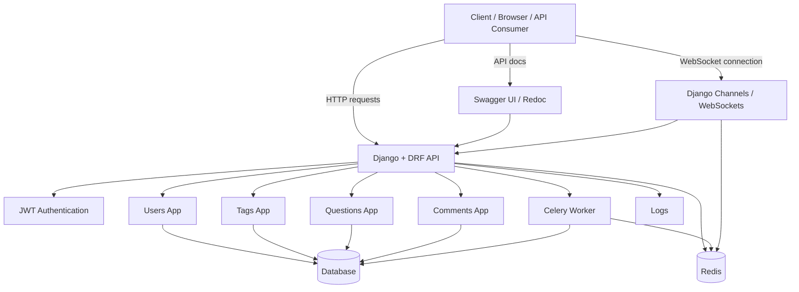
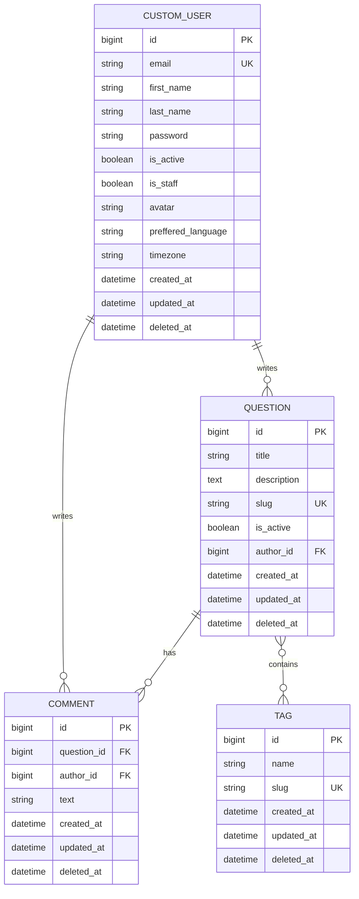

# Uldar Blog API

Uldar Blog API is a Django REST Framework backend for a small Q&A/blog-style platform. The project includes custom user authentication, tags, questions, comments, API documentation, background tasks, Redis, Celery, WebSocket support, tests, Docker configuration, logging, and localization files.

## Table of Contents

- [Project Overview](#project-overview)
- [Main Features](#main-features)
- [Technology Stack](#technology-stack)
- [Project Structure](#project-structure)
- [Architecture Diagram](#architecture-diagram)
- [ER Diagram](#er-diagram)
- [API Documentation](#api-documentation)
- [API Endpoints](#api-endpoints)
- [Authentication Flow](#authentication-flow)
- [Environment Variables](#environment-variables)
- [Run with Docker](#run-with-docker)
- [Run Locally without Docker](#run-locally-without-docker)
- [Database and Migrations](#database-and-migrations)
- [Celery and Redis](#celery-and-redis)
- [WebSockets](#websockets)
- [Testing](#testing)
- [Code Quality](#code-quality)
- [Troubleshooting](#troubleshooting)

## Project Overview

The backend is built around four main domain modules:

- **Users** — custom user model with email-based authentication and JWT tokens.
- **Tags** — tag creation, listing, and retrieval.
- **Questions** — question CRUD actions, author filtering, tags, and comment creation from a question.
- **Comments** — comment creation, listing, update, retrieval, and filtering by author.

The project uses a modular Django structure with apps separated by responsibility. API schemas are documented with **drf-spectacular**, and interactive documentation is available through Swagger and Redoc.

## Main Features

- Custom user model based on `email` instead of username.
- JWT authentication with access and refresh tokens.
- Separate serializers for different API actions.
- Custom validation for user registration and login.
- Question model with author relation and many-to-many tags.
- Comment model linked to both author and question.
- Query optimization with `select_related`, `prefetch_related`, and annotated fields.
- Swagger and Redoc API documentation.
- Redis cache configuration.
- Celery worker for background tasks.
- Channels/Redis configuration for WebSockets.
- Docker Compose setup with Django, PostgreSQL, Redis, and Celery worker.
- Logging to console and rotating file handler.
- Localization folders for English, Russian, and Kazakh.
- Pytest-based test suite.

## Technology Stack

| Area | Technology |
|---|---|
| Backend | Django, Django REST Framework |
| Auth | Simple JWT |
| API Docs | drf-spectacular, Swagger UI, Redoc |
| Database | SQLite in local settings, PostgreSQL service in Docker Compose |
| Async / WebSockets | Django Channels, Daphne, channels-redis |
| Background tasks | Celery |
| Cache / Broker | Redis |
| Tests | pytest, pytest-django, channels testing |
| Code Quality | Ruff, Flake8, Isort |
| Runtime | Python 3.12 |
| Deployment / Local infra | Docker, Docker Compose |

## Project Structure

```text
uldar_net/
├── apps/
│   ├── abstract/          # Shared abstract models
│   ├── common/            # Shared response helpers
│   ├── users/             # Custom user model, auth, serializers, views
│   ├── tags/              # Tag model and API
│   ├── questions/         # Question model and API
│   ├── comments/          # Comment model and API
│   ├── chat/              # WebSocket consumers and routing
│   └── tasks.py           # Celery tasks
├── settings/
│   ├── base.py            # Base Django settings
│   ├── conf.py            # Env, DRF, CORS, Redis config
│   ├── celery.py          # Celery application
│   ├── asgi.py            # ASGI app
│   ├── wsgi.py            # WSGI app
│   ├── urls.py            # Root URL config
│   └── env/
│       └── local.py       # Local settings
├── tests/                 # Pytest test suite
├── scripts/               # Helper shell scripts
├── requirements/          # Python dependencies
├── locale/                # Translation files
├── docker-compose.yml
├── Dockerfile
├── manage.py
├── pytest.ini
├── pyproject.toml
├── .env.example
└── schema.yml
```

## Architecture Diagram



## ER Diagram



## API Documentation

After starting the server, documentation is available at:

| Tool | URL |
|---|---|
| Swagger UI | `http://localhost:8000/api/docs/` |
| Redoc | `http://localhost:8000/api/redoc/` |
| OpenAPI schema | `http://localhost:8000/api/schema/` |
| Django admin | `http://localhost:8000/admin/` |

## API Endpoints

### Auth and Users

| Method | Endpoint | Auth | Description |
|---|---|---|---|
| `POST` | `/api/users/register` | No | Register a new user |
| `POST` | `/api/users/login` | No | Login and receive JWT tokens |
| `POST` | `/api/users/token/refresh` | No | Refresh access token |
| `PUT` | `/api/users/update-language` | Yes | Update user preferred language |
| `PUT` | `/api/users/update-timezone` | Yes | Update user timezone |

### Tags

| Method | Endpoint | Auth | Description |
|---|---|---|---|
| `GET` | `/api/tags/list` | Read allowed | List tags |
| `POST` | `/api/tags/create` | Yes | Create tag |
| `GET` | `/api/tags/{id}/retrieve` | No | Retrieve tag by ID |

### Questions

| Method | Endpoint | Auth | Description |
|---|---|---|---|
| `GET` | `/api/questions/list` | No | List questions |
| `GET` | `/api/questions/{id}/retrieve` | No | Retrieve question by ID |
| `POST` | `/api/questions/create` | Yes | Create question |
| `PATCH` | `/api/questions/{id}/update` | Yes | Update question |
| `DELETE` | `/api/questions/{id}/destroy` | Yes | Delete question |
| `POST` | `/api/questions/{id}/create_comment` | Yes | Create comment for a question |
| `GET` | `/api/questions/list_by_author?author=<id>` | No | List questions by author |

### Comments

| Method | Endpoint | Auth | Description |
|---|---|---|---|
| `GET` | `/api/comments/list` | No | List comments |
| `POST` | `/api/comments/create` | Yes | Create comment |
| `GET` | `/api/comments/{id}/retrieve` | No | Retrieve comment by ID |
| `PATCH` | `/api/comments/{id}/update` | Yes | Update comment |
| `GET` | `/api/comments/list_by_author?author=<id>` | No | List comments by author |

## Authentication Flow

1. Register a user:

```http
POST /api/users/register
Content-Type: application/json

{
  "first_name": "Sardelka",
  "last_name": "Zefirov",
  "email": "example@mail.com",
  "password": "strong_password123"
}
```

2. Login:

```http
POST /api/users/login
Content-Type: application/json

{
  "email": "example@mail.com",
  "password": "strong_password123"
}
```

3. Use the returned access token:

```http
Authorization: Bearer <access_token>
```

## Environment Variables

Create `.env` from `.env.example`:

```bash
cp .env.example .env
```

Example variables:

```env
SECRET_KEY=your-secret-key
DEBUG=TRUE
DB_NAME=your_db_name
DB_USER=postgres
DB_PASSWORD=your_password
DB_HOST=pgdb
DB_PORT=5432
JWT_SECRET_SECRET_KEY=your-jwt-secret
ULDAR_NET_ENV_ID=local
ULDAR_NET_SECRET_KEY=your-django-secret-key
ULDAR_NET_REDIS_HOST=redis
ULDAR_NET_REDIS_PORT=6379
CELERY_ULDAR_NET_REDIS_DB=1
CELERY_TASK_TIME_LIMIT=1800
ULDAR_NET_CHANNELS_REDIS_HOST=redis
ULDAR_NET_CHANNELS_REDIS_PORT=6379
```

## Run with Docker

Build and start all services:

```bash
docker compose up --build
```

Or use the helper script:

```bash
bash scripts/run.sh
```

The main Django service is named `django` and the container name is `django_docker`.

Useful commands:

```bash
# Show running containers
docker compose ps

# Open a shell inside Django container
docker compose exec django bash

# Run Django command inside container
docker compose exec django python manage.py <command>
```

## Run Locally without Docker

```bash
python -m venv .venv
source .venv/bin/activate
pip install -r requirements/base.txt
cp .env.example .env
python manage.py migrate
python manage.py runserver
```

## Database and Migrations

Apply migrations:

```bash
docker compose exec django python manage.py makemigrations
docker compose exec django python manage.py migrate
```

Create a superuser:

```bash
docker compose exec django python manage.py createsuperuser
```

Seed the database if the seed command is available:

```bash
bash scripts/seed.sh
```

### Important note about the current local database settings

The current `settings/env/local.py` uses SQLite:

```python
DATABASES = {
    "default": {
        "ENGINE": "django.db.backends.sqlite3",
        "NAME": "db.sqlite3",
    },
}
```

At the same time, `docker-compose.yml` includes a PostgreSQL service named `pgdb`. If the project must use PostgreSQL in Docker, update `settings/env/local.py` to read PostgreSQL variables from `.env`, for example:

```python
DATABASES = {
    "default": {
        "ENGINE": "django.db.backends.postgresql",
        "NAME": config("DB_NAME"),
        "USER": config("DB_USER"),
        "PASSWORD": config("DB_PASSWORD"),
        "HOST": config("DB_HOST"),
        "PORT": config("DB_PORT", cast=int),
    }
}
```

If you see this error:

```text
OperationalError: no such table: users_customuser
```

run migrations inside the Django container:

```bash
docker compose exec django python manage.py makemigrations
docker compose exec django python manage.py migrate
```

## Celery and Redis

Redis is used for caching, Celery broker/result backend, and Channels.

Start Celery with Docker Compose:

```bash
docker compose up celery_worker
```

Celery app path:

```text
settings.celery:app
```

Example task usage in the project:

```python
send_confirmation_mail.delay(user_email=user.email)
```

## WebSockets

The project includes Django Channels configuration and chat consumers.

ASGI application:

```text
settings.asgi:application
```

Docker runs Django with Daphne:

```bash
daphne -b 0.0.0.0 -p 8000 settings.asgi:application
```

Redis is used as the Channels layer:

```text
redis://redis:6379/3
```

## Testing

Run tests locally:

```bash
pytest -v
```

Or through the helper script:

```bash
bash scripts/test.sh
```

The tests cover users, tags, questions, comments, and Channels consumers.

## Code Quality

Run lint checks:

```bash
bash scripts/lint.sh
```

The project includes Ruff configuration in `pyproject.toml` and also uses Flake8 and Isort scripts.

## Troubleshooting

### 1. `no such table: users_customuser`

The database exists, but migrations were not applied.

```bash
docker compose exec django python manage.py makemigrations
docker compose exec django python manage.py migrate
```

For local SQLite development, if the DB is broken and there is no important data, recreate it:

```bash
rm -f db.sqlite3
python manage.py migrate
```

Inside Docker:

```bash
docker compose exec django rm -f db.sqlite3
docker compose exec django python manage.py migrate
```

### 2. Logs directory error

The logging config writes to:

```text
/app/logs/debug.log
```

Make sure the `logs` directory exists:

```bash
mkdir -p logs
```

### 3. Redis connection error

Check that Redis is running:

```bash
docker compose ps redis
```

Restart Redis if needed:

```bash
docker compose restart redis
```

### 4. Port 8000 already in use

Stop the conflicting process or change port mapping in `docker-compose.yml`:

```yaml
ports:
  - "8001:8000"
```

### 5. PostgreSQL service is running but Django still uses SQLite

This is expected with the current local settings. Update `settings/env/local.py` if PostgreSQL must be used by Django.

## Quick Start

```bash
cp .env.example .env
docker compose up --build
```

In another terminal:

```bash
docker compose exec django python manage.py makemigrations
docker compose exec django python manage.py migrate
```

Then open:

```text
http://localhost:8000/api/docs/
```

